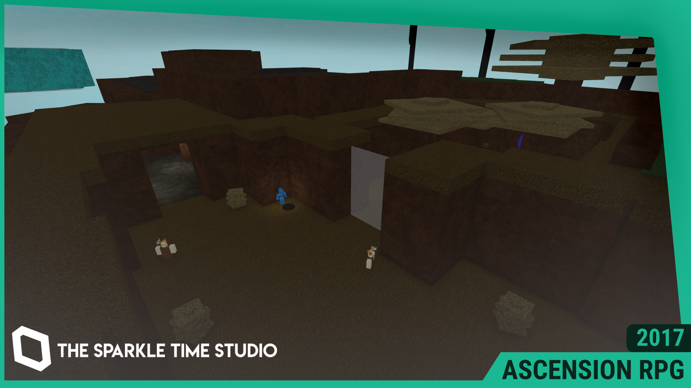

# ASCENSION RPG
Ascension RPG is an RPG I created in 2017, where my goal was to try a new project that included a couple new mechanics to my games, like Mana &amp; Magic weapons. as well as an advancements menu. Now open-source for the Roblox OSS & Classic RPG community.

This repository contains the latest version of the game under The Sparkle Time Studio, version 116 (published August 7, 2021).

# Usage
Feel free to download, use, modify, distribute and publish this project to your hearts content, under the MIT License. All I ask is that you repost the original license in this document if you plan to fork this software, or give me credit (@Evercyan on Roblox) if you plan to republish it on the Roblox website.
